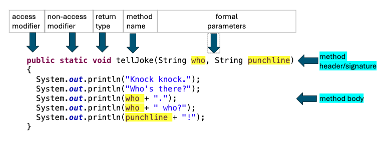
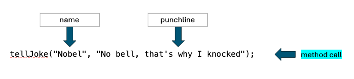

# Writing Methods

## Learning Goals

- Learning Goal 1
- Learning Goal 2

## Introduction

A program often requires an operation to be performed repeatedly on different data values. This may result in redundant code that is difficult to understand, debug, and maintain.  

Code redundancy can be reduced by creating a block of reusable code. 
A **method** allows us to name a block of code that can be called to operate on specific data values.  

How do methods improve software? 

- A big problem is solved by dividing into subproblems. 
- Code duplication is eliminated, making code easier to reuse and maintain.


## Code-Along Instructions

Walk the student through any setup required to run the lesson.....


## Why code duplication is a problem

Consider the repetitive structure of a knock-knock joke.  
The only difference between the following two jokes is:

1. The **name** of who is at the door, and
2. The **punchline**.

|Line| Joke#1 | Joke#2 |
|---| --- | ----------- |
|1| Knock-knock. | Knock-knock. |
|2| Who's there? | Who's there? |
|3| Nobel. | Figs. |
|4| Nobel who? | Figs who? |
|5| Nobel…that’s why I knocked! | Figs the doorbell, it's not working!  |

The code below prints the two sample jokes. The  `name` and `punchline` variables are used to illustrate the common structure among knock-knock jokes. 

```java
public class JokeMakerCodeDuplication {

	public static void main(String[] args) {
		
		//Tell first joke
		String name = "Nobel";
		String punchline = "Nobel…that’s why I knocked";
		
		System.out.println("Knock knock");
		System.out.println("Who's there");
		System.out.println(name);
		System.out.println(name + " who");
		System.out.println(punchline);
		
		//Tell second joke
		name = "Figs";
		punchline = "Figs the doorbell, it's not working";
		
		System.out.println("Knock knock");
		System.out.println("Who's there");
		System.out.println(name);
		System.out.println(name + " who");
		System.out.println(punchline);
	}

}
```

Notice the 5 print statements are identical for both jokes, and punctuation was accidentally omitted at the end of each line. If we want to update the jokes to add punctuation, we must perform the exact same changes to both sets of print statements.  While this example is trivial, code duplication is a maintenance issue in real applications as it is often difficult to locate and consistently update all occurrences of duplicated code.
 
We will eliminate the redundancy by defining a new method called `tellJoke()`.  A method is defined within a Java class and consists of a header and body.  The  header is also called a method signature, and includes an access modifier, static modifier, return type, name, and formal parameters. The method body consists of a set of statements enclosed in curly braces { }.



- Most of the methods we'll write will be declared using the `public` and `static` modifiers.  We'll cover what these modifiers mean in a later lesson.   
- The return type indicates the type of value returned by the method.  The `tellJoke()` method prints to the console but does not return a value so the return type is `void`. 
-  A method is typically named using a verb that describes its purpose, such as `tellJoke()`.  
- The formal parameters `name` and `punchline` allow different values to be substituted for the joke when the method is called. The method body uses the parameter variables in the print statements.

We call the `tellJoke` method by passing in values for `name` and `punchline` as shown below.  The values passed into the method call are called `arguments` or `actual parameters`, and should correspond to the order and type of the formal parameters. :




The `JokeMaker` class contains both the `tellJoke()` and `main()` methods. Note the methods could be listed in any order within the class.  The `main()` method calls `tellJoke()` twice, passing different values into the `name` and `punchline` parameters.

```java
public class JokeMaker {
	
	public static void tellJoke(String who, String punchline) {
		System.out.println("Knock knock.");
		System.out.println("Who's there?");
		System.out.println(who + ".");
		System.out.println(who + " who?");
		System.out.println(punchline + "!");
	}

	public static void main(String[] args) {
		tellJoke("Nobel", "No bell, that's why I knocked");
		
		System.out.println();
		
		tellJoke("Figs", "Figs the doorbell, it's not working");
	}

}}
```

Run the program and confirm the output:

```text
Knock knock.
Who's there?
Nobel.
Nobel who?
No bell, that's why I knocked!

Knock knock.
Who's there?
Figs.
Figs who?
Figs the doorbell, it's not working!
````

Use Python Tutor's visual debugger to step through the code by clicking this link:
[Visualize JokeMaker execution](https://pythontutor.com/render.html#code=%0Apublic%20class%20JokeMaker%20%7B%0A%20%20%20%20%0A%20%20%20%20public%20static%20void%20tellJoke%28String%20who,%20String%20punchline%29%20%7B%0A%20%20%20%20%20%20%20%20System.out.println%28%22Knock%20knock.%22%29%3B%0A%20%20%20%20%20%20%20%20System.out.println%28%22Who's%20there%3F%22%29%3B%0A%20%20%20%20%20%20%20%20System.out.println%28who%20%2B%20%22.%22%29%3B%0A%20%20%20%20%20%20%20%20System.out.println%28who%20%2B%20%22%20who%3F%22%29%3B%0A%20%20%20%20%20%20%20%20System.out.println%28punchline%20%2B%20%22!%22%29%3B%0A%20%20%20%20%7D%0A%0A%20%20%20%20public%20static%20void%20main%28String%5B%5D%20args%29%20%7B%0A%20%20%20%20%20%20%20%20tellJoke%28%22Nobel%22,%20%22No%20bell,%20that's%20why%20I%20knocked%22%29%3B%0A%20%20%20%20%20%20%20%20%0A%20%20%20%20%20%20%20%20System.out.println%28%29%3B%0A%20%20%20%20%20%20%20%20%0A%20%20%20%20%20%20%20%20tellJoke%28%22Figs%22,%20%22Figs%20the%20doorbell,%20it's%20not%20working%22%29%3B%0A%20%20%20%20%7D%0A%0A%7D&cumulative=false&curInstr=0&heapPrimitives=nevernest&mode=display&origin=opt-frontend.js&py=java&rawInputLstJSON=%5B%5D&textReferences=false)


## Deliverables

List each of the deliverables the student must complete in order to finish the
lab. Provide as much context as possible, including instructions on how to run
the tests and other means of validating successful completion of deliverables.

## Conclusion

A short one or two paragraph summary of the contents of the lessons, recapping
the learning goals.

## Resources

- [Python Tutor](http://pythontutor.com)

